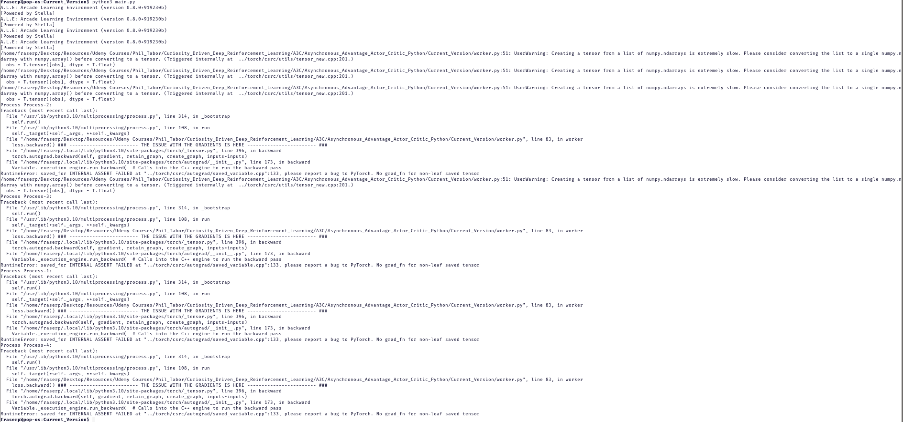

# Asynchronous_Advantage_Actor_Critic_Python

This is an implementation of Phill Tabor's A3C agent from the course: "Curiosity Driven Deep Reinforcement Learning". 
The various modules used in the course have changed since its initial recording. Most notably; gym has changed the return values in its env.step function to the end of increasing the verbosity of the "done" value. 

I have attempted to implement A3C as demonstrated, updated for the current version of gym - at present, this is version 0.26.2. 
Unfortunately this is not a functional A3C agent as it stands. There is a fairly severe pytorch error relating to the calculation of the agent's loss function that I have been unable to resolve as of yet. 

See the enclosed screenshot for details:

